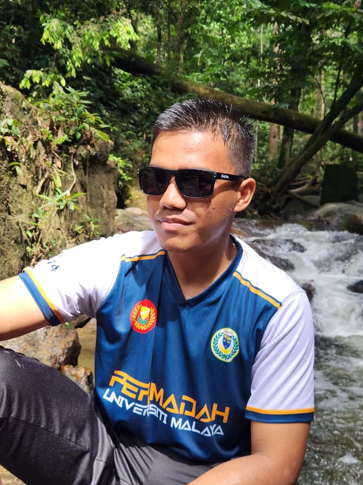

  

<h1 align="center">Hi 👋, I'm Abdul Hanif Bin Abdul Aziz</h1>
<h3 align="center">A student in the Framework-Based Software Design and Development course!</h3>

<h3>My expectation for this Course</h3>

 - I hope to learn a lot about modern software maintenance practices and how to work with legacy systems

 - Learnt how keep a software well-maintained and evolving through legacy systems

 - Able to apply suitable techniques and tools for performing software maintenance activities in my future career

 - Have the knowledge to use the strategies for evolving a legacy software system

 - Can distinguishes between software maintenance, maintenance processes and activities

 - Shoulc be able to tell the difference of each main categories of maintenance and techniques that are associated with them

You can view my personalized GitHub profile [[My Personal GitHub Profile](https://github.com/Nipz652)]

